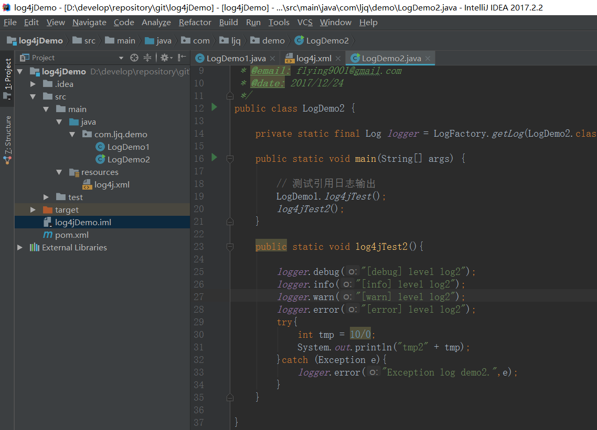

## commons-logging与log4j搭配的基本使用教程全解
    
### 1 Maven 引用  
    
    <dependency>
    <groupId>commons-logging</groupId>
    <artifactId>commons-logging</artifactId>
    <version>1.2</version>
    </dependency>
    <dependency>
    <groupId>log4j</groupId>
    <artifactId>log4j</artifactId>
    <version>1.2.17</version>
    </dependency>

**需要注意的是关于 Log4j 的引用，一定要是上边的，而不能是其他的(新版的 log4j-core是不行的)**  
    
### 2 配置文件  
    
log4j.properties 文件
java maven 项目目录: `src > main > resources > log4j.properties` (没有 `resources`)目录  
的可以新建  
普通 java 项目目录: `src > log4j.properties `  
log4j.properties  
<pre><code>  
# Root logger option
log4j.rootLogger=INFO, file, stdout

# Direct log messages to a log file
log4j.appender.file=org.apache.log4j.RollingFileAppender
log4j.appender.file.File=E:\\logs\\wyczDemo\\logs.log
log4j.appender.file.MaxFileSize=10MB
log4j.appender.file.MaxBackupIndex=10
log4j.appender.file.layout=org.apache.log4j.PatternLayout
log4j.appender.file.layout.ConversionPattern=%d{yyyy-MM-dd HH:mm:ss} %-5p %c{1}:%L - %m%n

# Direct log messages to stdout
log4j.appender.stdout=org.apache.log4j.ConsoleAppender
log4j.appender.stdout.Target=System.out
log4j.appender.stdout.layout=org.apache.log4j.PatternLayout
log4j.appender.stdout.layout.ConversionPattern=%d{yyyy-MM-dd HH:mm:ss} %-5p %c{1}:%L - %m%n

# appoint package log level
log4j.logger.com.ancun.ops=stdout

</code></pre>  

log4j.xml 配置文件  
    

	<?xml version="1.0" encoding="UTF-8"?>
	<!DOCTYPE log4j:configuration PUBLIC "-//APACHE//DTD LOG4J 1.2//EN" "log4j.dtd">
	<log4j:configuration >
    <!-- ConsoleAppender -->
    <appender name="console" class="org.apache.log4j.ConsoleAppender">
        <param name="Target" value="System.out" />
        <layout class="org.apache.log4j.PatternLayout">
            <param name="ConversionPattern" value="%d %-5p: %l - %m%n" />
        </layout>
    </appender>

    <!-- RollingFileAppender 回滚文件 -->
    <!-- Append true，默认每次启动系统，日志继续输出到原来的文件，而不是清空了再来 -->
    <!-- MaxBackupIndex 最多20个 -->
    <!-- filter 级别范围过滤器 -->
    <appender name="mainLog" class="org.apache.log4j.RollingFileAppender">
        <param name="File" value="e:\\logs\\wyczDemo\\main.log" />
        <param name="Append" value="true"/>
        <param name="MaxFileSize" value="10MB"/>
        <param name="MaxBackupIndex" value="20"/>
        <layout class="org.apache.log4j.PatternLayout">
            <param name="ConversionPattern" value="%d %-5p: %l - %m%n" />
        </layout>
        <filter class="org.apache.log4j.varia.LevelRangeFilter">
            <param name="levelMin" value="INFO" />
            <param name="levelMax" value="ERROR" />
            <param name="AcceptOnMatch" value="true" />
        </filter>
    </appender>
    <!-- 仅记录 ERROR 级别日志 -->
    <appender name="errorLog" class="org.apache.log4j.RollingFileAppender">
        <param name="File" value="e:\\logs\\wyczDemo\\error.log" />
        <param name="Append" value="true"/>
        <param name="MaxFileSize" value="10MB"/>
        <param name="MaxBackupIndex" value="20"/>
        <layout class="org.apache.log4j.PatternLayout">
            <param name="ConversionPattern" value="%d %-5p: %l - %m%n" />
        </layout>
        <filter class="org.apache.log4j.varia.LevelRangeFilter">
            <param name="levelMin" value="ERROR" />
            <param name="levelMax" value="ERROR" />
            <param name="AcceptOnMatch" value="true" />
        </filter>
    </appender>

    <!-- 以下是设定不同的类输出不同级别的日志,对于项目本身的package起作用,项目引用的jar不一定起作用-->
    <logger name="com.ljq.demo.LogDemo1" additivity="false">
        <level value="error" />
        <appender-ref ref="errorLog" />
    </logger>

    <!-- 根logger -->
    <root>
        <priority value="debug" />
        <appender-ref ref="console" />
        <appender-ref ref="mainLog" />
        <appender-ref ref="errorLog" />
    </root>

    </log4j:configuration>
    
关于log4j.xml 配置文件,具体属性在配置文件中已经注释    
该 log4j.xml文件实现的功能: `debug` 级别及以上的日志都会通过 `console` (控制台)输出    
`info`级别到 `error` 级别的日志会通过 `mainLog` 输出到指定文件, 错误日志单独通过 `errorLog`  
输出到指定文件,`com.ljq.demo.LogDemo1` 中只有 `error` 级别的日志会通过 `errorLog`  
被记录(`com.ljq.demo.LogDemo1`必须是项目中本身的package/class,如果是引用的 `jar` 则  
不一定起作用)  
    
### 3. 测试用例  
    
LogDemo1.java 
```  
package com.ljq.demo;

import org.apache.commons.logging.Log;
import org.apache.commons.logging.LogFactory;

/**
 * @description: demo class 1
 * @author: lujunqiang
 * @email: flying9001@gmail.com
 * @date: 2017/12/24
 */
public class LogDemo1 {

    private static final Log logger = LogFactory.getLog(LogDemo1.class);

    public static void log4jTest(){

        logger.debug("[debug] level log");
        logger.info("[info] level log");
        logger.warn("[warn] level log");
        logger.error("[error] level log");
        try{
            int tmp = 10/0;
            System.out.println("tmp" + tmp);
        }catch (Exception e){
            logger.error("Exception log demo.",e);
        }

    }

}

```  
    
LogDemo2.java  
    
```  
package com.ljq.demo;

import org.apache.commons.logging.Log;
import org.apache.commons.logging.LogFactory;

/**
 * @description: log demo class 2
 * @author: lujunqiang
 * @email: flying9001@gmail.com
 * @date: 2017/12/24
 */
public class LogDemo2 {

    private static final Log logger = LogFactory.getLog(LogDemo2.class);

    public static void main(String[] args) {

        // 测试引用日志输出
        LogDemo1.log4jTest();
        log4jTest2();
    }

    public static void log4jTest2(){

        logger.debug("[debug] level log2");
        logger.info("[info] level log2");
        logger.warn("[warn] level log2");
        logger.error("[error] level log2");
        try{
            int tmp = 10/0;
            System.out.println("tmp2" + tmp);
        }catch (Exception e){
            logger.error("Exception log demo2.",e);
        }
    }

}

```  
    
### 4. 测试效果  
    
控制台(console)日志输出  
```  
2017-12-24 21:56:40,419 DEBUG: com.ljq.demo.LogDemo2.log4jTest2(LogDemo2.java:25) - [debug] level log2
2017-12-24 21:56:40,419 INFO : com.ljq.demo.LogDemo2.log4jTest2(LogDemo2.java:26) - [info] level log2
2017-12-24 21:56:40,419 WARN : com.ljq.demo.LogDemo2.log4jTest2(LogDemo2.java:27) - [warn] level log2
2017-12-24 21:56:40,419 ERROR: com.ljq.demo.LogDemo2.log4jTest2(LogDemo2.java:28) - [error] level log2
2017-12-24 21:56:40,423 ERROR: com.ljq.demo.LogDemo2.log4jTest2(LogDemo2.java:33) - Exception log demo2.
java.lang.ArithmeticException: / by zero
	at com.ljq.demo.LogDemo2.log4jTest2(LogDemo2.java:30)
	at com.ljq.demo.LogDemo2.main(LogDemo2.java:20)

```  
    
`e:\\logs\\wyczDemo\\main.log` 日志:  
    
```  
2017-12-24 21:56:40,419 INFO : com.ljq.demo.LogDemo2.log4jTest2(LogDemo2.java:26) - [info] level log2
2017-12-24 21:56:40,419 WARN : com.ljq.demo.LogDemo2.log4jTest2(LogDemo2.java:27) - [warn] level log2
2017-12-24 21:56:40,419 ERROR: com.ljq.demo.LogDemo2.log4jTest2(LogDemo2.java:28) - [error] level log2
2017-12-24 21:56:40,423 ERROR: com.ljq.demo.LogDemo2.log4jTest2(LogDemo2.java:33) - Exception log demo2.
java.lang.ArithmeticException: / by zero
	at com.ljq.demo.LogDemo2.log4jTest2(LogDemo2.java:30)
	at com.ljq.demo.LogDemo2.main(LogDemo2.java:20)

```  
    
`e:\\logs\\wyczDemo\\error.log` 日志:  
    
```  
2017-12-24 21:56:40,412 ERROR: com.ljq.demo.LogDemo1.log4jTest(LogDemo1.java:21) - [error] level log
2017-12-24 21:56:40,416 ERROR: com.ljq.demo.LogDemo1.log4jTest(LogDemo1.java:26) - Exception log demo.
java.lang.ArithmeticException: / by zero
	at com.ljq.demo.LogDemo1.log4jTest(LogDemo1.java:23)
	at com.ljq.demo.LogDemo2.main(LogDemo2.java:19)
2017-12-24 21:56:40,419 ERROR: com.ljq.demo.LogDemo2.log4jTest2(LogDemo2.java:28) - [error] level log2
2017-12-24 21:56:40,423 ERROR: com.ljq.demo.LogDemo2.log4jTest2(LogDemo2.java:33) - Exception log demo2.
java.lang.ArithmeticException: / by zero
	at com.ljq.demo.LogDemo2.log4jTest2(LogDemo2.java:30)
	at com.ljq.demo.LogDemo2.main(LogDemo2.java:20)

```  
    
    
<font color=red>**日志结果: `main.log` 相对于控制台日志,少了 `debug` 级别的日志,  
`error.log` 相对于 `main.log`只包含 `error` 级别的日志,同时包含 `com.ljq.demo.LogDemo1`  
类中的 `error` 日志,而`main.log` 中不包含 `com.ljq.demo.LogDemo1` 的日志**</font>  


### 5. 项目结构图  
    



